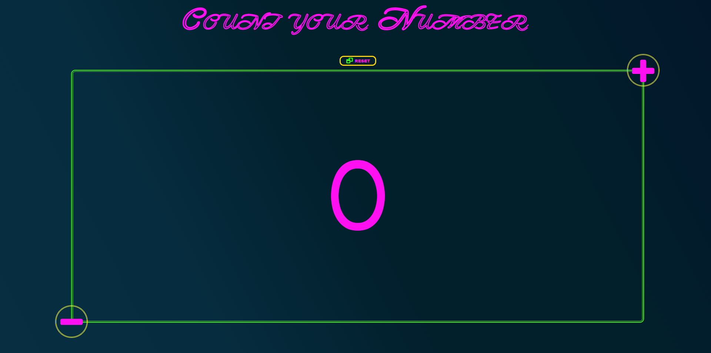

# count-your-number

Count Your Number is a web application that allows you to count numbers with a simple click.

Inside there are **six buttons** to increase or decrease the number put on the display and **one** to reset it back to 0.

To go see the web app and try out its features click on the [LINK](https://count-your-number.netlify.app/) or image.
